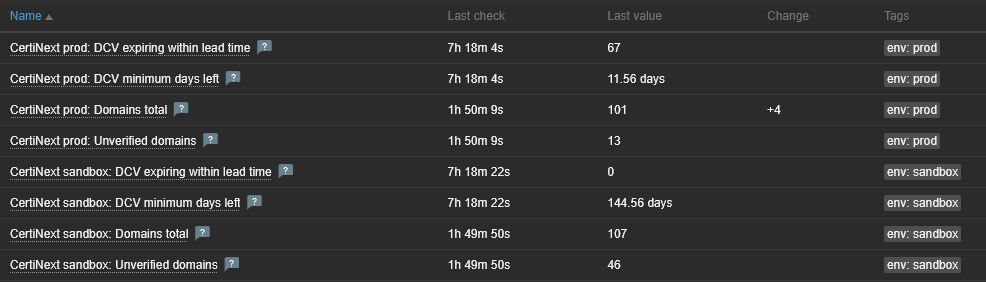

# certinext-zabbix

CertiNext DCV health monitoring for Zabbix: a trapper-only Zabbix template
plus the `certinext-zabbix-push` CLI that feeds it. For any InCommon /
higher-ed operator using [CertiNext](https://www.entrust.com/products/certinext)
who wants Domain Control Validation (DCV) expiry and verification-state
visibility in Zabbix.

## AI-agent quickstart

The short version, for an agent working with this repo without reading the
whole README:

- **One command:** `certinext-zabbix-push` — computes CertiNext DCV health
  metrics and pushes them to Zabbix as trapper item values. Needs CertiNext
  OAuth credentials (`CERTINEXT_CLIENT_ID`/`CERTINEXT_CLIENT_SECRET`) and a
  reachable Zabbix server; no other network access.
- **`certinext-zabbix-push --dry-run -v` is the safe first run** — it
  computes and prints the metrics without sending anything to Zabbix.
- **Installing or deploying this on a server** (systemd timer, cron, or an
  Ansible playbook)? Everything needed — install command, environment
  variables, unit files, network requirements, validation steps — is in
  **[docs/deployment.md](docs/deployment.md)**. Don't reconstruct it from
  this README.
- **Importing the Zabbix template?** See
  [templates/template_certinext/7.0/README.md](templates/template_certinext/7.0/README.md)
  for macros, metrics, and triggers — it stands on its own.
- **Working on the code?** Dev setup, test/lint/type-check commands, and
  the copy-not-canonical relationship with `ums-certinext-scripts` (a
  University of Maine System internal repository — not publicly
  accessible, mentioned only for provenance) are in
  [CLAUDE.md](CLAUDE.md)/[AGENTS.md](AGENTS.md); a map of all docs is in
  [llms.txt](llms.txt).
- **Why was X built this way?** See [docs/adr/](docs/adr/) for accepted
  decisions and [docs/wishlist/](docs/wishlist/) for ideas deferred for
  later.

## Requirements

- A CertiNext account with OAuth API credentials (account number + client
  secret).
- A Zabbix 7.0 server, reachable on its trapper port (10051 by default)
  from wherever the pusher runs.
- Python ≥ 3.11.

## Install

```bash
pip install git+https://github.com/tod-uma/certinext-zabbix
```

This repo is PyPI-ready but not yet published there — see
[CLAUDE.md](CLAUDE.md) for what flipping to PyPI would take if that's ever
wanted.

## Quickstart

1. **Import the template**:
   [templates/template_certinext/7.0/template_certinext.yaml](templates/template_certinext/7.0/template_certinext.yaml)
   via *Data collection → Templates → Import*. Follow the
   [per-template README](templates/template_certinext/7.0/README.md) to
   link it to a host, match the host name, and set
   `{$CERTINEXT.SENDER.ALLOWED}` — the template rejects every sender until
   you do.
2. **Run the pusher**:

   ```bash
   export CERTINEXT_CLIENT_ID=...
   export CERTINEXT_CLIENT_SECRET=...
   certinext-zabbix-push --zabbix-server your.zabbix.example --dry-run -v
   ```

   Drop `--dry-run` once the metrics look right. Add `--expiry-days 14` on
   a daily schedule to also push DCV-expiry metrics (see
   [docs/deployment.md](docs/deployment.md) for the two-schedule systemd
   and cron setups, or [examples/windows/](examples/windows/) for Task
   Scheduler — **untested, review before production use**).

The pushed metrics are printed to stdout as one JSON object; logs go to
stderr.

## What it looks like

Zabbix's Latest Data view after importing the template and linking two
hosts (`prod` and `sandbox`):



These are live values from our own deployment, not staged demo data.

## `KEY_*` ↔ template sync

The Zabbix item keys the pusher writes (`KEY_*` constants in
[certinext_zabbix/zabbix_push.py](certinext_zabbix/zabbix_push.py)) must
match the trapper items defined in
[templates/template_certinext/7.0/template_certinext.yaml](templates/template_certinext/7.0/template_certinext.yaml).
If you fork or edit the template, keep both in sync — a mismatched key
results in `"Zabbix rejected item values"` at push time, not a schema
error.

## Development

```bash
uv sync --extra dev
uv run pytest
uv run ruff check .
uv run mypy certinext_zabbix
uv run pyright
```

See [CLAUDE.md](CLAUDE.md) and [AGENTS.md](AGENTS.md) for more.

## License

[MIT](LICENSE).
